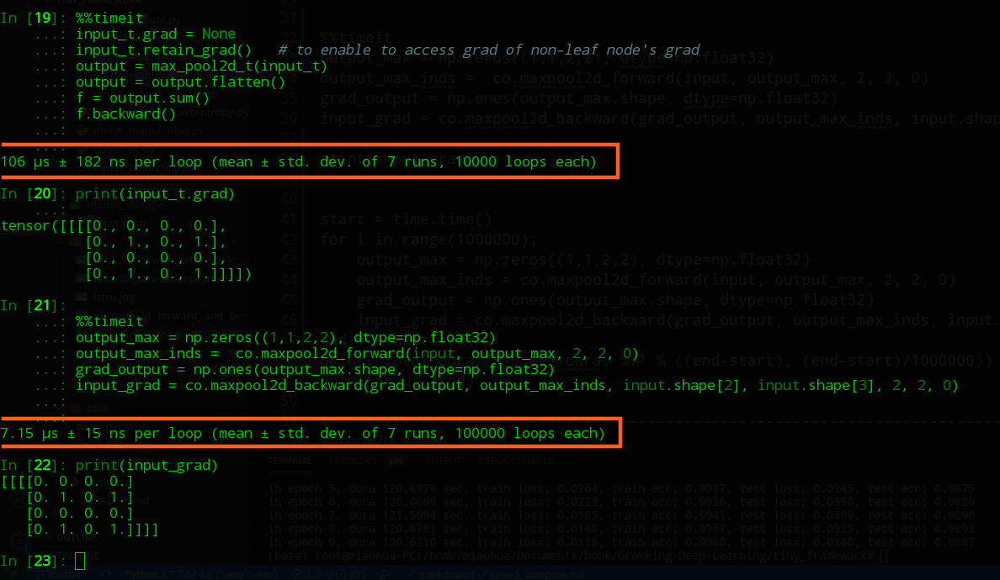

Tiny Framework

It is a tiny framework for teaching purpose to learn how forward & backward work in neural network.
The repo also includes some manual scripts for nn teaching under folder *manual*

I rewrite conv & max pool operation in c++, which speedup the forward&backward almost 100 times.

To install the module conv_operations you should have [pybind11](https://github.com/pybind/pybind11/tree/stable) installed.

Then what you need to do is going into the **framework** folder and run the following code:

```sh
pip install ./conv_operations
```
To uninstall it, just run  
```sh
pip uninstall conv_operations
```

Here is some speed compare between my code and torch(note all code is running on cpu)  
1.the conv2d forward operation

2.the conv2d forward&backward operation  
  
3.the maxpool2d forward operation  
  
4.the maxpool2d forward&backward operation  

