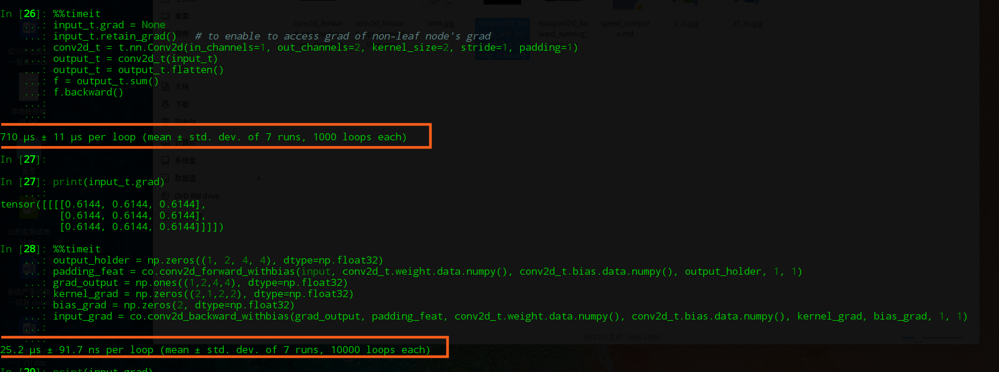

Tiny Framework

It is a tiny framework for teaching purpose to learn how forward & backward work in neural network.
The repo also includes some manual scripts for nn teaching under folder *manual*

I rewrite conv & max pool & batchnorm operation in c++, which speedup the forward&backward almost 100 times.

To install the module conv_operations you should have [pybind11](https://github.com/pybind/pybind11/tree/stable) installed.

Then what you need to do is going into the **framework** folder and run the following code:

```sh
pip install ./conv_operations
```
To uninstall it, just run  
```sh
pip uninstall conv_operations
```

Here is some speed compare between my code and torch(note all code is running on cpu)  
1.the conv2d forward operation  
  
2.the conv2d forward&backward operation  
  
3.the maxpool2d forward operation  
  
4.the maxpool2d forward&backward operation  
  
5.the batchnorm2d forward operation  
  
6.the batchnorm2d forward&backward operation  
  

By the tiny framework, we write the LeNet, AlexNet, VGG16 to test the framework, and we use the cnn network to classify cifar10 & mnist dataset to compare pytorch and ours. The result is as followings:  
1.LeNet on mnist, the first 5 epochs are done by pytorch, the second 5 epochs are done by tiny framework  

  

2.VGG16 on cifar10(both pytorch version and mine use torchvision library's pre-trained weights),  
the following 5 epochs are pytorch version  
  
  
  
the following 5 epochs are mine  
  


3.We resize cifar10(only have 32*32 resolution) to 224*224 by skimage.transform.resize before put it into AlexNet, because AlexNet has 11*11 & 5*5 etc. big cnn kernel, cifar10 is too small to do that.  

